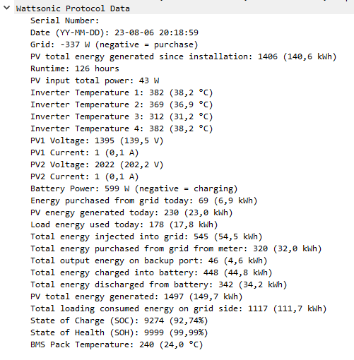

# Wattsonic Wireshark dissector
This is a Wireshark dissector for Wattsonic inverters. It sends data to 2 IP addreses in my case. I tried to parse some fields I found out (check out doc directory). I use Modbus to query the device, but if you want you can do it with this too.

# How?

Create a mirrored port or capture on your router/modem. Filter on port 5743. Copy the `wattsonic.lua` to your Wireshark plugins folder.

# Why use this when you can also query with Modbus?

I wanted to create a Wireshark dissector for fun, this protocol seemed simple enough.

The protocol is simple, all values have fixed offsets. Some values repeat like date/time. To find the offsets I looked at the Modbus responses and compared the values to the packet capture. There is no encryption. Every minute a update packet is sent to 2 IPs. The endpoints I found are `47.91.90.55` and `8.218.124.47`, both Alibaba Cloud.

# Example

Date consists of 6 bytes, starting at offset 26 (decimal). Bytes encode year, month, date, hour, minute, second in that order.

# Limitations

There are packets with 58 bytes, I did not investigate those.

# Other resources

https://smarthome.exposed/wattsonic-hybrid-inverter-gen3-modbus-rtu-protocol

https://github.com/GiZMoSK1221/hass-addons/tree/main/wattsonic
